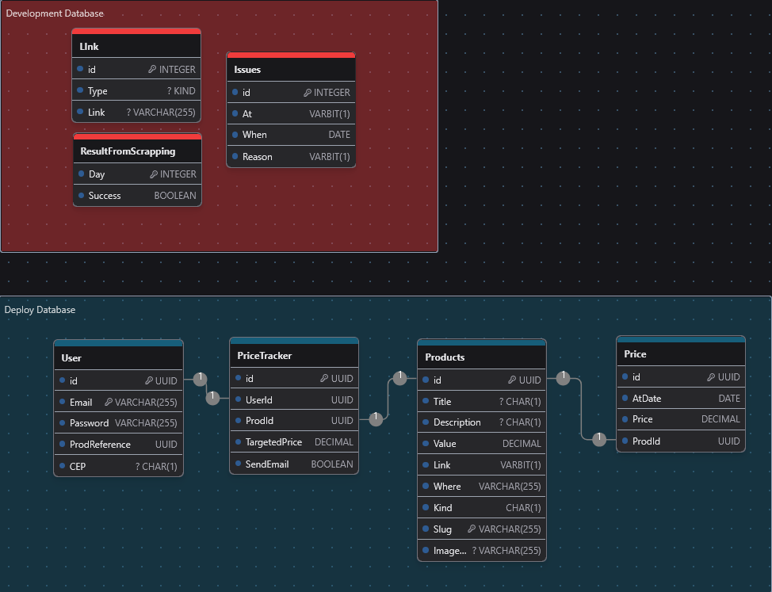

# HTP - Hardware Price Tracker WebScrapping aplication

HPT is a hardware price comparing tool that seeks and returns the best price in three diferent hardware shops in Brazil. This is the Web Scrapping service of this aplication. 

## Development and deploy database

Development database is a self provider of informations to the aplication. It's where we get informations about success and issues and also manage everything   
Deploy database is where the user will be connected and the reason of why this app exists. It's there that we will update and storage informations about pricing and price history of products. It's also there were we will store triggerAlerts and sensitive user informations like email, Password and CEP. 

